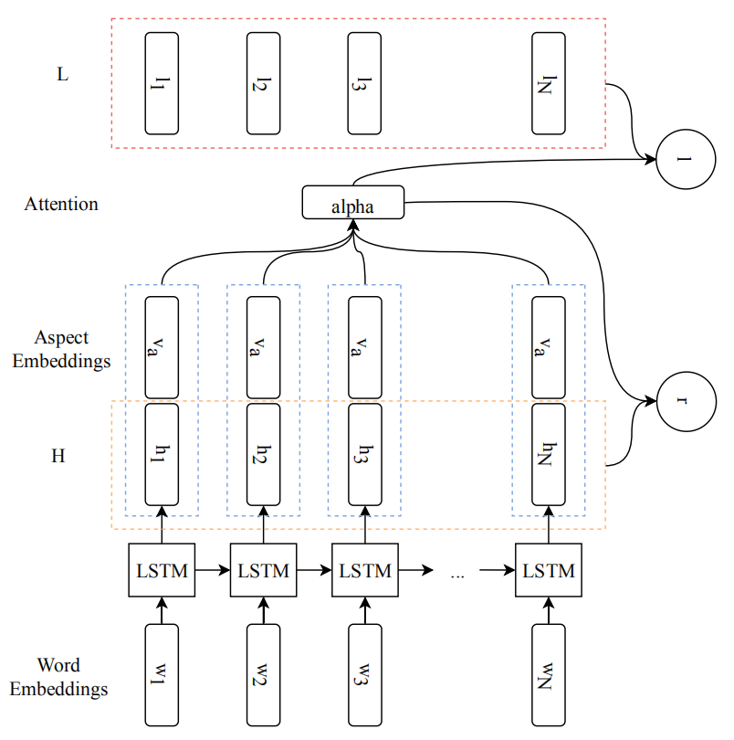

# Attention and Lexicon Regularized LSTM for Aspect-based Sentiment Analysis
注意力和词典正则化的LSTM用于方面级情感分析

## Abstract
端到端深度神经网络在训练数据少时缺乏灵活性，注意力机制可能会过度关注句子的特定部分，而忽略了为判断极性提供关键信息的位置<br>
作者提出利用词典信息这一简单有效方法，使模型灵活性和鲁棒性更强，另外，作者对注意力向量正则化，使模型获得对句子不同部分有更多的关注点

## Introduction
端到端深度学习缺乏灵活性，不能轻易地调整网络来解决一个明显的问题，比如'disappointed'（失望的）被预测为积极，'dungeon'（地牢）不能预测为消极<br>
注意力机制过度关注问题忽略关键信息，近年来，有人提出让注意力向量变得稀疏，作者认为这只能对过拟合的网络有帮助<br>
作者提出利用词典信息解决灵活性差的问题，对注意力向量正则化解决过度关注问题

## Related works

## Methodology

### Baseline AT-LSTM
作者采用Wang等人提出的AT-LSTM模型作为基线

M = tanh(\[W<sub>h</sub>H : W<sub>v</sub>v<sub>a</sub> ⊗ e<sub>N</sub>])<br>
α = softmax(w<sup>T</sup>M)<br>
r = Hα<sup>T</sup><br>
h<sup>∗</sup> = tanh(W<sub>p</sub>r + W<sub>x</sub>h<sub>N</sub>)<br>
y<sup>ˆ</sup> = softmax(W<sub>s</sub>h<sup>∗</sup> + b<sub>s</sub>)<br>
loss = -Σ<sub>i</sub> y<sub>i</sub>log(y<sup>ˆ</sup><sub>i</sub>)+λ||Θ||<sup>2</sup><sub>2</sub>

### ATLX

#### Lexicon Build
作者合并MPQA, Opinion Lexicon, Opener和Vader四个词典，SentiWordNet因引入噪音而被移除<br>
将每个词在不同词典的最大极性分数拼接，作为该词的极性分数向量

```
adorable [1.0, 1.0, 1.0, 0.55] MPQA(1.0), Opener(1.0), Opinion Lexicon(1.0) and Vader(0.55)
部分词典没有的词取所有可用词典的平均值作为缺失值
所有词典都没有的词取0向量
```

#### Lexicon Integration


L = W<sub>l</sub>V<sub>l</sub><br>
l = Lα<sup>T</sup><br>
h<sup>∗</sup> = tanh(W<sub>p</sub>r + W<sub>x</sub>h<sub>N</sub> + W<sub>l</sub>l)<br>


### Attention Regularization
由于注意力过拟合，模型更注意句子后面的部分，作者在损失函数加入对注意力分数的正则化

loss = -Σ<sub>i</sub>y<sub>i</sub>log(y<sup>ˆ</sup><sub>i</sub>)+λ||Θ||<sup>2</sup><sub>2</sub> + β · R(α)<br>
R(α)使用了两种计算方法：<br>
标准差：R(α) = σ(α)<br>
负信息熵：R(α) = =-\[-Σ<sub>i</sub><sup>N</sup> α<sub>i</sub> · log(α<sub>i</sub>)]

## Experiments

###  Dataset
SemEval-2014餐馆评论数据集<br>
方面：{food, price, service, ambience, miscellaneous}<br>
情感：{positive, neutral, negative}<br>
训练集：3518 测试集： 973<br>
词嵌入：GloVe_840b_300d

### Lexicons
&nbsp;|Pos|Neu|Neg|In Corpus
-|-|-|-|-
MPQA|2298|440|4148|908
OL|2004|3|4780|732
Opener|2298|440|4147|908
Vader|3333|0|4170|656
Merged U|5129|404|7764|1234


{bar, try, too}删除，极性被标为消极<br>
{n't, not}极性分数设置为-1

### Evaluation
&nbsp;|CV|σ<sup>CV</sup>|TEST|σ<sup>TEST</sup>
-|-|-|-|-
base|75.27|1.420|81.48|1.157
base<sup>std</sup>|74.67|1.688|81.57|0.915
base<sup>ent</sup>|**75.93**|1.467|82.24|0.863
ATLX|75.64|1.275|82.62|**0.498**
ATLX<sup>std</sup>|75.64|1.275|82.68|0.559
ATLX<sup>ent</sup>|75.53|**1.265**|**82.86**|1.115
ATLX<sup>*</sup>|74.99|1.638|82.03|1.409
base<sup>LX</sup>|71.98|1.588|79.24|2.322

CV：验证集<br>
<sup>std</sup>：损失函数加入标准差<br>
<sup>ent</sup>：损失函数加入负信息熵<br>
ATLX<sup>*</sup>：将词典信息加入到注意力分数的计算<br>
base<sup>LX</sup>：将情感分数拼接到词嵌入作为基线的输入

## Discussion

### ATLX
基线仅能够关注有情感信息的词，而ATLX还能够正确预测极性<br>
当词典信息加入到注意力的分数计算，ATLX<sup>*</sup>实验结果显示性能下降
```
我的分析：
1.AT-LSTM的注意力分数是由LSTM隐藏层输出H和方面嵌入v<sub>a</sub>计算出来的，加入词典信息需要训练新的参数，
  参数增加可能等同于引入噪声
2.词典信息的值两极分化严重，情感词数量远小于非情感词数量且非情感词的取值为0，加入情感信息会使过度关注问题更严重，
  抵消后面的注意力向量正则化的作用
```
base<sup>LX</sup>实验结果显示，词典信息需要经过处理才能对模型有更好的帮助

### Attention Regularization
标准差反映组内个体间的离散程度，在最小化标准差的过程中，注意力分数分配到相近甚至相同权重，这和注意力机制的想法相悖，因此标准差模型性能弱于负信息熵模型<br>
负信息熵模型虽然权重几乎均匀分布，但是它对对权重相对较高的几个位置保持敏感

## Parameter Settings
Parameter name|Value
-|-
batch size|25
aspect embedding dim|300
LSTM layer(s)|1
droupout|0.5
learning rate|0.01
λ|0.001
β base<sup>std</sup>|1e-3
β base<sup>ent</sup>|0.5
β ATLX<sup>std</sup>|1e-4
β ATLX<sup>ent</sup>|0.006

## Conclusion and Future Works
作者提出利用词典信息搭建神经网络，同时使用2种正则化方法减少注意力过拟合问题的影响<br>
特定于域和方面的细粒度词典可以进一步改善类似模型<br>
负信息熵正则化虽然能够减少过拟合问题，但是最好的方法是设计能够新的注意力框架，使得注意力的分布更清晰和稀疏，即关注更多位置的单词
